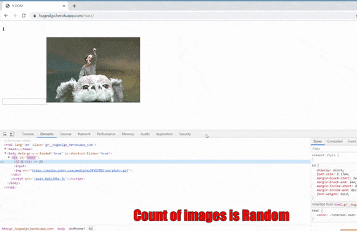

# Coding Questions
Interview questions and solutions.

# React Virtual DOM from Scratch

* [Web Link](https://hugealgo.herokuapp.com/react) - Web page for checking the output of implementation
* [CODE REF](https://github.com/hugebelieve/CodingQuestions/blob/master/public/vDom/main.js) - Reference to virtual DOM code  and implementation

# Notes taking App
* [Follow Link](https://hugealgo.herokuapp.com/vanhack/note)

# Example for testing
* [Heroku App](https://hugealgo.herokuapp.com) - Web page for testing all algo

# Actual Code
* [Code Directory](https://github.com/hugebelieve/CodingQuestions/tree/master/DataStructure) - Codes for solved algo

# Triumps
* [Photos](https://github.com/hugebelieve/CodingQuestions/tree/master/DataStructure/Triump) - Screenshots of LeetsCode all cases pass

# Concepts
* [Conceps](https://github.com/hugebelieve/CodingQuestions/tree/master/DataStructure/concepts) - Concepts learned while learning

# My Resume
* [Resume](https://github.com/hugebelieve/CodingQuestions/blob/master/resume/CV%20JS%20Developer.pdf)

